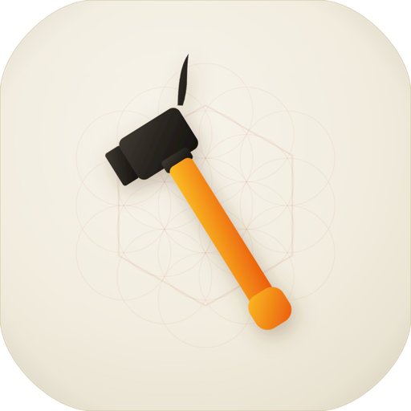

# Devbox

<p align="center">
  
</p>

<p align="center">
  A native macOS developer toolbox — JSON, YAML, JWT, UUID, hashes, and more. 100% offline.
</p>

<p align="center">
  
  
  
</p>

Built with SwiftUI, fully offline — nothing ever leaves your machine.

## Download

Grab the latest `Devbox-vX.Y.Z-macos.zip` from [Releases](../../releases), unzip, and drag **Devbox.app** to `/Applications`.

The build is ad-hoc signed (not notarized), so the first launch needs a Gatekeeper OK:

- **Right-click → Open**, or
- `xattr -dr com.apple.quarantine /Applications/Devbox.app`

## Tools

| Category | Tools |
|---|---|
| **Formats** | JSON formatter/validator (format · minify · escape · live error line/col), YAML formatter + YAML↔JSON, JWT decoder (claims, expiry warnings), Text diff |
| **Encoders** | Base64 (URL-safe, hex mode), URL encode/decode (RFC 3986 component vs full-URL), HTML entities |
| **Generators** | UUID (v4 random · v5 name-based · string→UUID converter · validator with version/variant/timestamp inspection · format converter incl. Java byte[]), Epoch/timestamp converter, Hashes (MD5 · SHA-1 · SHA-2 · HMAC), Color converter |
| **Text** | Regex tester (live matches, groups, replace), 21 text transforms |

## Build from source

Requires Xcode Command Line Tools (no full Xcode needed):

```sh
./build_app.sh        # release build → build/Devbox.app
open build/Devbox.app
```

Or develop directly:

```sh
swift build
swift run Devbox
```

CI builds every push to `main`; tags (`vX.Y.Z`) build a Release automatically via GitHub Actions.

## Layout

```
Sources/Devbox/
  DevboxApp.swift       # app entry + window + crash-loop self-heal
  Core/                 # sidebar, tool registry, editor, hashing, UUIDKit, diff engine
  Tools/                # one file per tool
```

**Adding a tool**: create `Sources/Devbox/Tools/MyToolView.swift`, then register it in
`Core/Tools.swift` (a `DevTool` entry with category, icon, and search keywords).

## Privacy

Everything runs locally. No network calls at runtime (the SwiftPM build pulls
[Yams](https://github.com/jpsim/Yams) only at compile time).

## License

[MIT](LICENSE)
